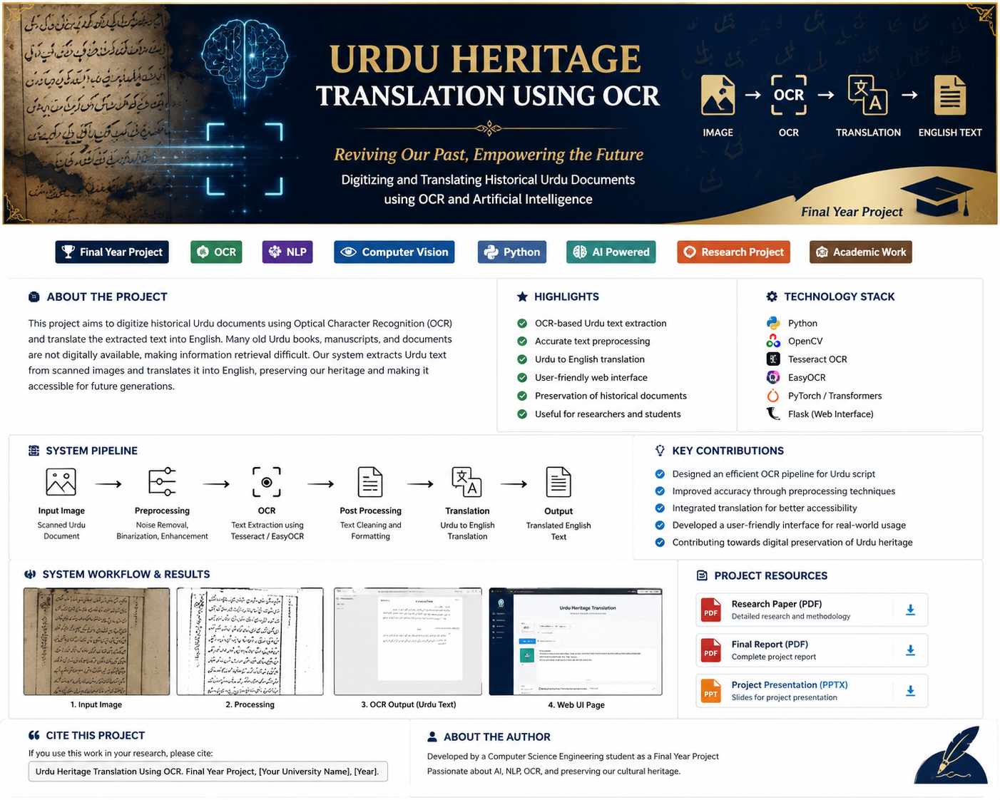
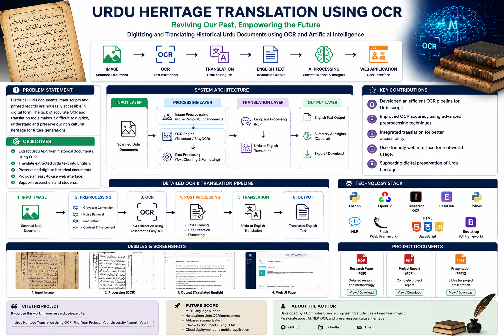
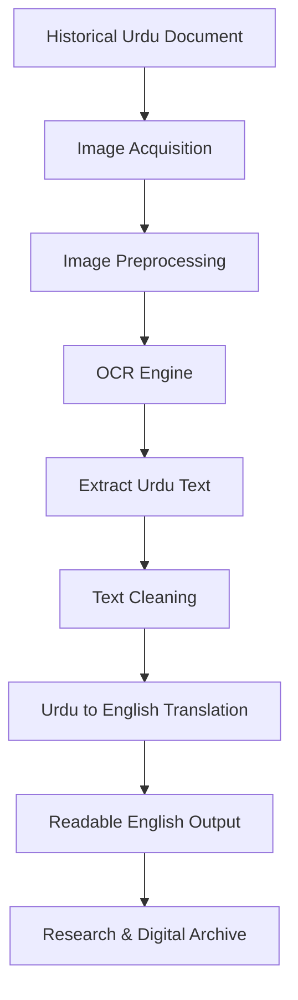
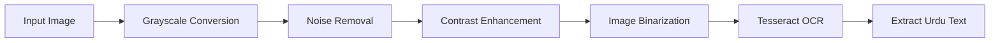
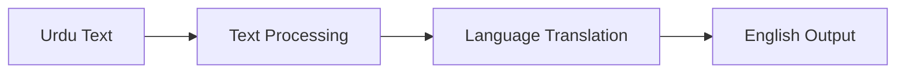
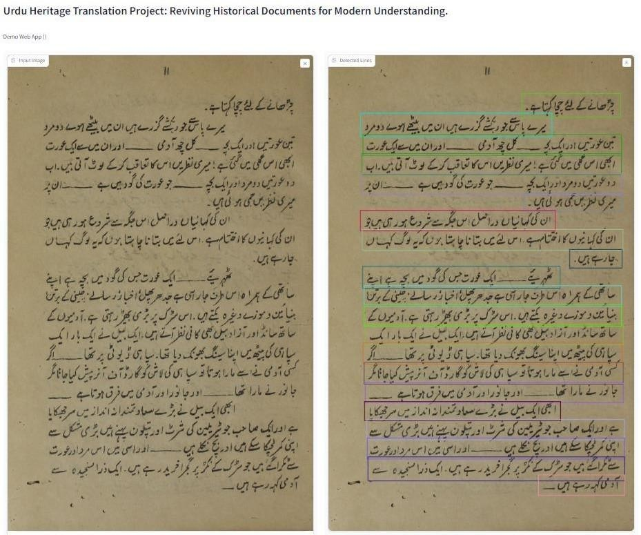
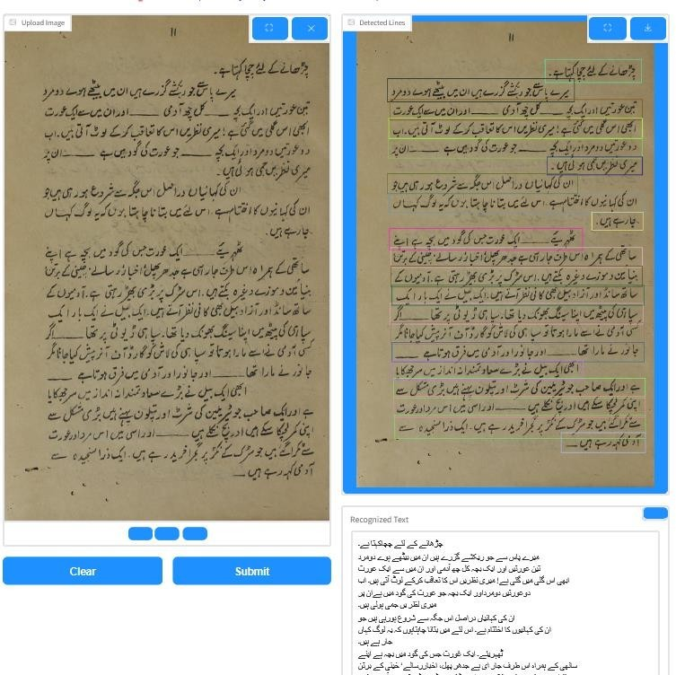
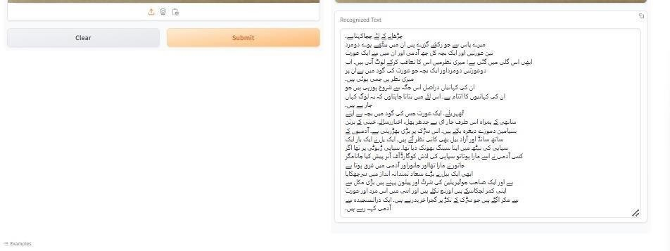

<p align="center">
  
</p>

<h1 align="center">
📜 Urdu Heritage Translation Using OCR
</h1>

<p align="center">

<b>Reviving Historical Urdu Documents through Optical Character Recognition and Artificial Intelligence</b>

</p>

<p align="center">

A Final Year Research Project focused on digitizing historical Urdu manuscripts using OCR technology, Natural Language Processing, and Artificial Intelligence to preserve cultural heritage and improve accessibility.

</p>

---

<p align="center">


</p>

<p align="center">


</p>

---

# 📖 Abstract

Historical Urdu books, manuscripts, newspapers, and official documents preserve an enormous amount of cultural, literary, and historical knowledge. Unfortunately, a significant portion of these documents exists only in printed or scanned form, making them difficult to search, translate, or digitally preserve.

This project presents an intelligent OCR-based document digitization system capable of extracting Urdu text from scanned images and translating it into readable English. The proposed solution combines image preprocessing, Optical Character Recognition (OCR), and language processing techniques to improve accessibility to historical Urdu archives.

The objective is not only to recognize Urdu text accurately but also to preserve valuable historical resources for researchers, students, historians, and future generations.

---

# 🎯 Project Objectives

The major objectives of this research project are:

- Digitize historical Urdu documents
- Extract Urdu text using OCR
- Improve recognition accuracy through image preprocessing
- Translate Urdu content into English
- Preserve historical manuscripts digitally
- Improve accessibility for researchers
- Reduce manual transcription effort
- Demonstrate the practical use of OCR for Urdu script

---

# 🌍 Project Overview

Urdu Heritage Translation Using OCR is an academic research project developed as part of a Bachelor of Technology (Computer Science & Engineering) final year project.

The project demonstrates how Optical Character Recognition can be applied to historical Urdu manuscripts to automatically extract textual information from scanned documents.

Unlike conventional OCR applications, this project focuses specifically on the challenges associated with Urdu script, including:

- Complex ligatures
- Right-to-left writing
- Historical fonts
- Low-quality scans
- Ink degradation
- Noise
- Skewed pages

To address these issues, the project integrates image preprocessing techniques before OCR extraction to improve recognition quality and generate more accurate English translations.

---

# 📊 Research Highlights

| Feature | Description |
|----------|-------------|
| 📄 OCR Extraction | Automatic Urdu text extraction |
| 🌍 Translation | Urdu → English |
| 🧠 AI Assistance | Intelligent text processing |
| 🖼 Image Processing | OpenCV preprocessing |
| 📚 Historical Preservation | Digital archive generation |
| 🎓 Academic Research | Final Year Engineering Project |

---

# 🏆 Key Contributions

- Developed an OCR workflow for historical Urdu documents.
- Improved recognition quality through preprocessing.
- Demonstrated Urdu-to-English translation workflow.
- Designed an easy-to-understand research prototype.
- Contributed towards digital preservation of Urdu heritage.

---

# 🖼 Project Overview

<p align="center">



</p>

The above infographic summarizes the complete research workflow, including document acquisition, OCR extraction, translation pipeline, system architecture, project contributions, screenshots, and supporting research documents.

---

# 📂 Repository Contents

This repository contains the complete documentation associated with the Final Year Research Project.

Included resources:

- 📄 Research Paper
- 📘 Complete Project Report
- 📊 Project Presentation (PPT)
- 🖼 Project Screenshots
- 🎨 Project Banner
- 📈 Research Infographic

---

# 📚 Table of Contents

- Abstract
- Project Objectives
- Project Overview
- Problem Statement
- Research Methodology
- System Architecture
- OCR Pipeline
- Translation Pipeline
- Experimental Results
- Screenshots
- Research Paper
- Project Report
- Project Presentation
- Technology Stack
- Future Work
- Citation
- Author

---
# ❓ Problem Statement

Urdu is one of the richest literary languages in South Asia, with thousands of valuable books, newspapers, manuscripts, government records, and historical archives preserved only in printed form.

Most of these historical documents are difficult to access digitally because they suffer from several challenges:

- Poor scan quality
- Ink fading
- Noise and blur
- Skewed pages
- Complex Urdu ligatures
- Historical fonts
- Right-to-left writing system
- Lack of searchable digital text

Traditional OCR systems often perform poorly on historical Urdu documents due to these complexities.

As a result, researchers, historians, students, and libraries spend significant time manually reading and translating documents.

This project addresses these challenges by combining image preprocessing, Optical Character Recognition (OCR), and translation techniques to transform scanned Urdu documents into searchable and readable English text.

---

# 🎯 Research Objectives

The primary objectives of this research include:

- Digitize historical Urdu documents.
- Extract Urdu text using OCR.
- Improve OCR accuracy through preprocessing.
- Translate Urdu text into English.
- Preserve historical archives digitally.
- Reduce manual transcription effort.
- Support educational and historical research.
- Demonstrate practical applications of OCR for low-resource languages.

---

# 🔬 Research Methodology

The proposed methodology follows a sequential document processing pipeline.

1. Historical Urdu documents are scanned.
2. Images undergo preprocessing.
3. OCR extracts Urdu text.
4. Extracted text is cleaned.
5. Translation converts Urdu into English.
6. Results are evaluated and presented.

The overall workflow minimizes manual intervention while maximizing text extraction quality.

---

# 🏗️ System Architecture



---

# ⚙️ Overall Workflow

```text
Historical Document
          │
          ▼
Image Scanning
          │
          ▼
Image Enhancement
          │
          ▼
OCR Extraction
          │
          ▼
Urdu Text
          │
          ▼
Text Cleaning
          │
          ▼
English Translation
          │
          ▼
Readable Output
          │
          ▼
Digital Preservation
```

---

# 🔍 OCR Processing Pipeline



---

# 🌍 Translation Pipeline



---

# 📚 Research Method

| Stage | Description |
|--------|-------------|
| Image Acquisition | Scan Urdu historical documents |
| Image Processing | Improve image quality |
| OCR | Extract Urdu text |
| Post Processing | Remove OCR errors |
| Translation | Urdu to English |
| Output | Readable English document |

---

# 🧩 Image Preprocessing

Image preprocessing is a crucial stage because OCR accuracy depends heavily on image quality.

Techniques applied include:

- Grayscale Conversion
- Noise Reduction
- Contrast Enhancement
- Thresholding
- Image Binarization
- Skew Correction
- Text Region Enhancement

These preprocessing operations significantly improve OCR performance for historical Urdu documents.

---

# 📝 OCR Engine

The OCR module is responsible for recognizing Urdu characters from scanned documents.

Major tasks include:

- Character Recognition
- Word Recognition
- Line Detection
- Text Extraction
- Layout Analysis
- Unicode Text Generation

The extracted Urdu text is then forwarded to the translation module.

---

# 🌐 Translation Module

The translation module converts recognized Urdu text into understandable English.

Main responsibilities:

- Text Normalization
- Sentence Processing
- Urdu → English Translation
- Formatting
- Readable Output Generation

---

# 📈 Expected Outcomes

The proposed system successfully demonstrates:

- Digital preservation of Urdu heritage
- Automatic Urdu text extraction
- Improved OCR accuracy
- Readable English translation
- Reduced manual effort
- Improved accessibility for historical documents

---

# 💡 Research Significance

This project contributes toward preserving cultural heritage by making historical Urdu documents digitally accessible.

The proposed workflow can be extended to:

- National Archives
- Libraries
- Museums
- Universities
- Research Institutions
- Digital Humanities Projects

It also serves as a foundation for future AI-based document understanding systems.

---
# 📸 Experimental Results

The proposed OCR pipeline was tested on historical Urdu documents to evaluate its ability to recognize and translate printed Urdu text.

The following images demonstrate the complete workflow from document acquisition to translated output.

---

# 📂 Input Document

<p align="center">



</p>

The input consists of scanned historical Urdu documents containing complex typography, faded ink, and handwritten-like printed characters.

---

# ⚙️ OCR Processing

<p align="center">



</p>

During processing, the document undergoes multiple preprocessing stages including:

- Image Enhancement
- Grayscale Conversion
- Noise Removal
- Contrast Enhancement
- OCR Recognition
- Text Cleaning

These preprocessing operations significantly improve OCR performance.

---

# 📄 OCR & Translation Output

<p align="center">



</p>

The OCR engine extracts Urdu text and converts it into machine-readable Unicode format.

The extracted text is then translated into English for improved accessibility and understanding.

---

# 🌐 Web Application Interface

<p align="center">


</p>

A simple web interface was developed to demonstrate the proposed OCR system.

Users can

- Upload Urdu documents
- Process OCR
- View extracted Urdu text
- Read translated English output

---

# 📊 Experimental Workflow

```text
Historical Urdu Document
          │
          ▼
Image Acquisition
          │
          ▼
Image Preprocessing
          │
          ▼
OCR Recognition
          │
          ▼
Text Cleaning
          │
          ▼
Translation
          │
          ▼
Readable English Output
```

---

# 📈 Results

The developed prototype successfully demonstrates

- Automatic Urdu text extraction
- Improved OCR accuracy
- Readable English translation
- Faster document digitization
- Reduced manual transcription effort
- Preservation of historical documents

---

# 📚 Project Resources

This repository contains all documentation related to the research project.

| Resource | Description |
|----------|-------------|
| 📄 ResearchPaper.pdf | Published research paper |
| 📘 Report.pdf | Complete final year project report |
| 📊 PPT.pptx | Final project presentation |
| 🖼 Screenshots | Experimental results |
| 🎨 Banner | Repository banner |
| 📑 Infographic | Complete project overview |

---

# 📄 Research Paper

The complete research paper describing the methodology, implementation, experiments, and results is available below.

<p align="center">

## 📥 [View Research Paper](ResearchPaper.pdf)

</p>

---

# 📘 Final Project Report

The comprehensive project report contains detailed documentation including:

- Literature Review
- Problem Statement
- Objectives
- Methodology
- System Design
- Experimental Results
- Conclusion

<p align="center">

## 📥 [View Project Report](Report.pdf)

</p>

---

# 📊 Project Presentation

The presentation used during the Final Year Project evaluation.

<p align="center">

## 📥 [View Presentation](PPT.pptx)

</p>

---

# 💻 Technology Stack

| Category | Technologies |
|-----------|--------------|
| Programming Language | Python |
| OCR Engine | Tesseract OCR |
| Image Processing | OpenCV |
| Computer Vision | OpenCV |
| OCR Library | EasyOCR |
| NLP | Natural Language Processing |
| Translation | Urdu → English |
| UI | HTML, CSS, Bootstrap |
| Backend | Flask |
| Dataset | Historical Urdu Documents |

---

# 📦 Repository Structure

```text
urdu-heritage-translation-ocr/

│
├── assets/
│   ├── banner/
│   │      banner.png
│   │
│   ├── infographic/
│   │      project-overview.png
│   │
│   └── screenshots/
│          input.jpg
│          process.jpg
│          output.jpg
│          web UI page.png
│
├── ResearchPaper.pdf
├── Report.pdf
├── PPT.pptx
│
├── README.md
└── LICENSE
```

---

# 🏅 Research Contributions

This work contributes towards the digitization and preservation of historical Urdu literature by combining OCR techniques with translation workflows.

Major contributions include:

- OCR pipeline for Urdu documents
- Image preprocessing for improved recognition
- Automatic Urdu text extraction
- Urdu to English translation
- Research prototype for historical document preservation
- Foundation for future AI-based document understanding

---
# 🚀 Future Scope

Although the proposed system successfully demonstrates OCR-based digitization of historical Urdu documents, there are several opportunities for future enhancement.

Future work may include:

- AI-powered document understanding using Large Language Models (LLMs)
- Real-time Urdu handwriting recognition
- Multi-language translation support
- Retrieval-Augmented Generation (RAG)
- Chat with historical documents
- Automatic document classification
- Named Entity Recognition (NER)
- Historical document search engine
- Cloud-based OCR platform
- Mobile application support
- Semantic search for archived documents
- OCR support for additional regional languages

---

# 📊 Research Impact

This project contributes toward the preservation of historical Urdu literature by making valuable documents digitally accessible.

Potential beneficiaries include:

- Universities
- Libraries
- Museums
- Researchers
- Historians
- Students
- Government Archives
- Digital Humanities Projects

The proposed workflow reduces manual transcription effort while improving accessibility and long-term preservation of historical records.

---

# 📖 Publication

This Final Year Project resulted in a research publication.

The published paper discusses:

- Problem Statement
- Research Objectives
- Methodology
- OCR Workflow
- Experimental Results
- Translation Process
- Future Scope

📄 Research Paper

```
ResearchPaper.pdf
```

---

# 📘 Project Documentation

Complete documentation is included in the repository.

Available documents include:

- Final Year Project Report
- Research Paper
- PowerPoint Presentation
- Experimental Screenshots
- Repository Documentation

---

# 🎓 Academic Information

| Item | Details |
|------|---------|
| Project Type | Final Year Project |
| Degree | Bachelor of Technology (Computer Science & Engineering) |
| Domain | Artificial Intelligence |
| Research Area | Optical Character Recognition |
| Language | Urdu |
| Focus | Historical Document Digitization |

---

# 🏆 Project Achievements

✔ Successfully extracted Urdu text from scanned historical documents.

✔ Demonstrated Urdu-to-English translation workflow.

✔ Improved OCR accuracy using image preprocessing.

✔ Published research paper.

✔ Successfully completed Final Year Engineering Project.

✔ Demonstrated practical application of OCR for low-resource languages.

---

# 🤝 Contributing

This repository is primarily maintained for academic and research purposes.

Suggestions, improvements, and discussions are always welcome.

If you would like to contribute:

1. Fork the repository
2. Create a feature branch
3. Commit your changes
4. Push your branch
5. Open a Pull Request

---

# 🙏 Acknowledgements

Special thanks to the open-source community and the technologies that inspired this project.

- Python
- OpenCV
- Tesseract OCR
- EasyOCR
- Flask
- Bootstrap
- NumPy
- OCR Research Community

---

# 📚 Suggested Citation

If you use this work for academic purposes, please cite the accompanying research paper.

```text
Enayat Ullah,
"Urdu Heritage Translation Using Optical Character Recognition",
Bachelor of Technology Final Year Project,
Department of Computer Science & Engineering,
Sharda University,
2025.
```

---

# 📄 License

This repository is shared for educational and research purposes.

Please provide appropriate credit when using or referencing this work.

---

# 👨‍💻 Author

<p align="center">

# Enayat Ullah

**Computer Science Engineer**

**Artificial Intelligence • OCR • NLP • Computer Vision • Full-Stack Development**

Passionate about building AI-powered applications focused on document intelligence, OCR, Natural Language Processing, and Digital Heritage Preservation.

</p>

<p align="center">

<a href="https://github.com/ENAYATULLA">


</a>

<a href="https://www.linkedin.com/in/enayat-ullah-65a6a1252/">


</a>

<a href="mailto:enayatullah9857@gmail.com">


</a>

<a href="https://enayat-ullah-portfolio.vercel.app/">


</a>

</p>

---

<p align="center">

## ⭐ If you found this project interesting, please consider giving it a Star.

Research and innovation grow stronger through collaboration and knowledge sharing.

Made with ❤️ by **Enayat Ullah**

</p>